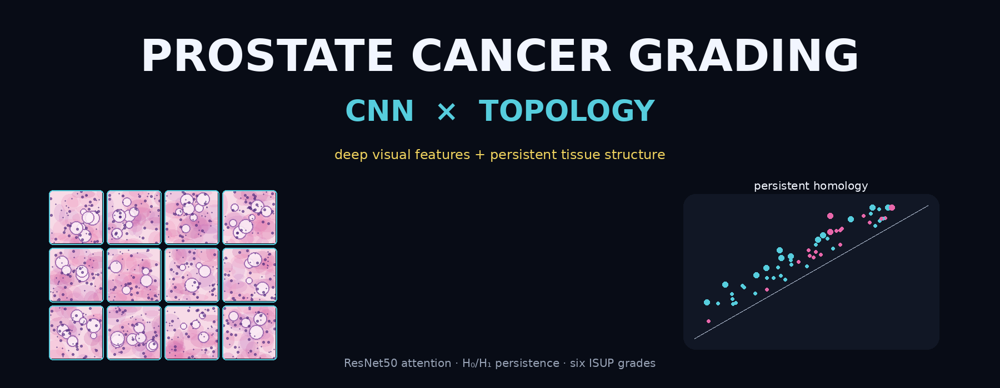
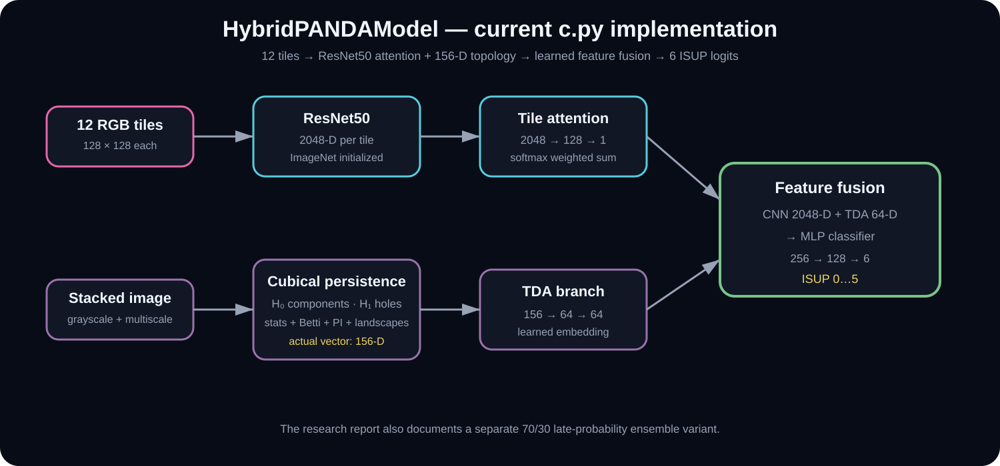
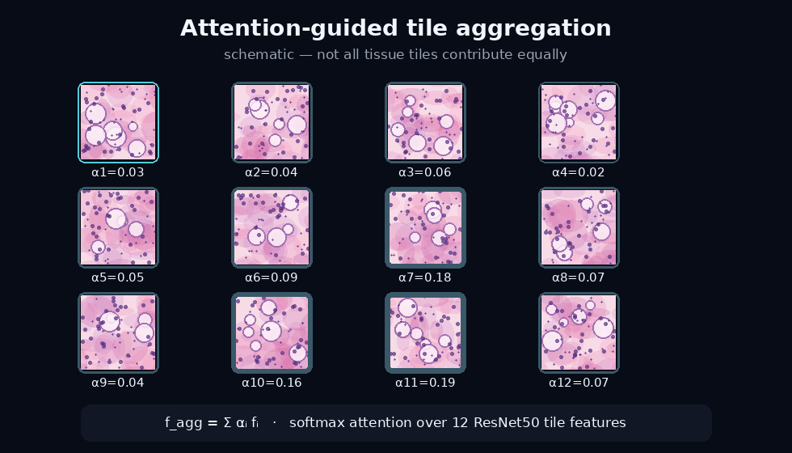
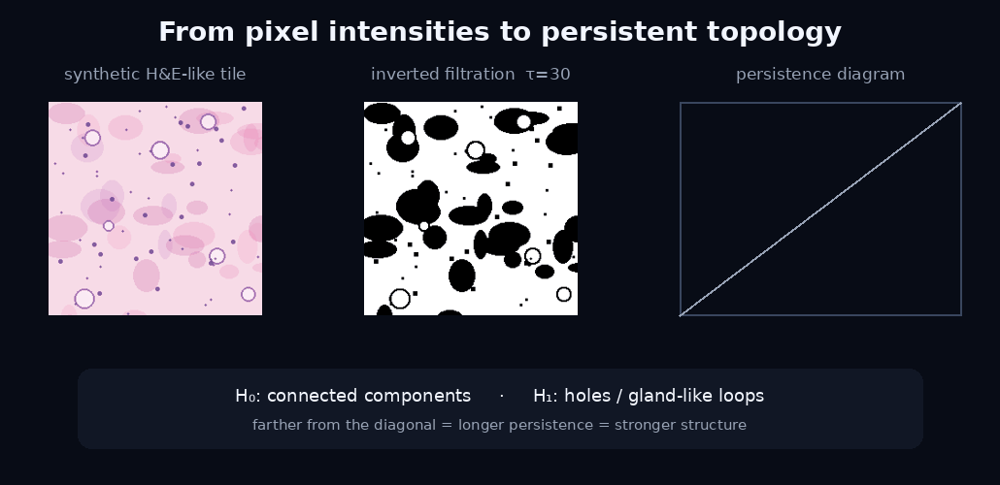
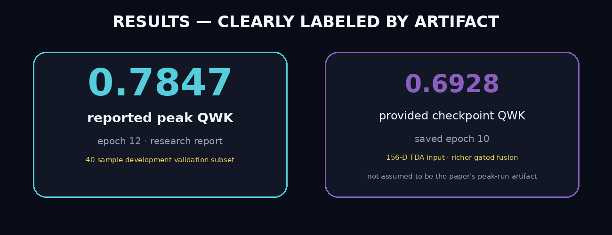
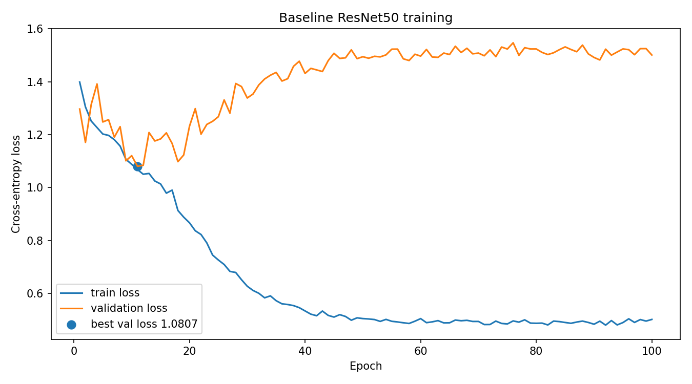
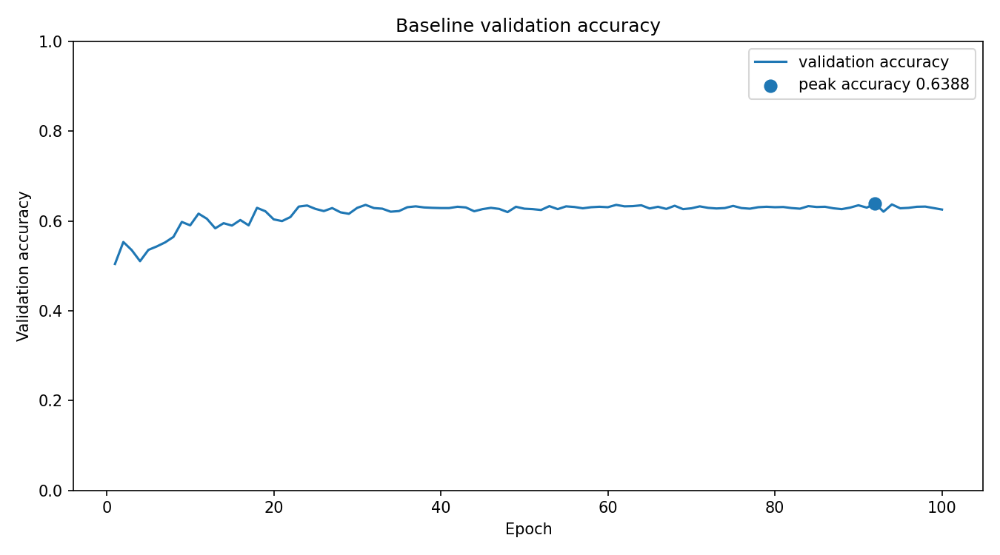

<p align="center">
  
</p>

<p align="center">
  <b>A research project at the intersection of deep learning, computational pathology, and mathematical topology.</b><br>
  ResNet50 learns visual patterns. Persistent homology measures tissue structure. Attention decides where to look.
</p>

<p align="center">
  
  
  
  
  
</p>

<p align="center">
  <a href="paper/TDA_CNN_cancer_grading.pdf"><b>Research report</b></a>
  &nbsp;·&nbsp;
  <a href="MODEL_CARD.md"><b>Model card</b></a>
  &nbsp;·&nbsp;
  <a href="#reproduce-the-project"><b>Reproduce</b></a>
</p>

---

## The research question

Prostate histopathology is not only about local texture. The **architecture of glands, holes, connected regions, and spatial organization** changes with cancer grade.

This project asks:

> **Can a neural network and topological data analysis capture complementary information about the same tissue?**

It studies two mathematical views of every sample:

- **CNN view** — learned visual patterns from a ResNet50 backbone;
- **topological view** — persistent components and holes extracted from tissue structure.

The target is six-class **ISUP grading (0–5)** from pre-tiled prostate histopathology images.

---

## The current hybrid implementation

Each sample contains **12 RGB tissue tiles**, each `128 × 128`.

The current `c.py` processes tiles independently with ResNet50, learns tile importance through attention, and combines the aggregated CNN representation with a learned TDA embedding.

<p align="center">
  
</p>

For tile features `f_i`, the attention-weighted representation is

```math
f_{agg} = \sum_{i=1}^{12} \alpha_i f_i.
```

---

## Attention — where should the model look?

Not every tile contributes equally.

The model maps each 2048-D ResNet50 feature through a small attention network and normalizes all 12 scores with softmax.

<p align="center">
  
</p>

*The animation is schematic; it explains the implemented mechanism and is not a patient-specific attention map.*

---

## Topology — what structure survives?

The TDA path converts tissue to grayscale, inverts intensities, and builds a **cubical filtration**. Persistent homology tracks structures as the filtration changes:

```text
H0 → connected components
H1 → holes / loops
```

<p align="center">
  
</p>

The current extractor builds features from both H0 and H1:

| Descriptor | Features per dimension |
|---|---:|
| Persistence statistics | 8 |
| Betti curve | 25 |
| Persistence-image summaries | 15 |
| Persistence-landscape samples | 30 |
| **Total** | **78** |

Therefore:

```math
2 \times 78 = 156
```

and the actual TDA vector is **156-dimensional**.

---

## Why topology can complement a CNN

A CNN learns local texture, boundaries, staining patterns, and hierarchical visual features.

Persistent homology asks a different question:

> which components and holes remain present as the image is gradually filtered?

That gives a direct mathematical language for glandular architecture:

- well-formed lumens can create persistent H1 features;
- cribriform structures can create multiple loops;
- architectural disorder changes the number, density, and lifetime of topological features.

The accompanying report includes H1 persistence diagrams for all six ISUP grades.

---

## Results — without mixing artifacts

<p align="center">
  
</p>

The repository preserves several experimental variants, so every metric is labeled by its source.

| Artifact | Metric | Context |
|---|---:|---|
| Research report | **Peak QWK 0.7847** | epoch 12; 40-sample development validation subset |
| Research report | Mean QWK 0.6901 | reported mean over hybrid training |
| Uploaded checkpoint | QWK **0.6928** | stored inside `best_model_finetuned.pt`; saved epoch 10 |
| Baseline log | Best val loss **1.0807** | epoch 11 |
| Baseline log | Peak val accuracy **0.6388** | epoch 92 |

The `0.7847` result is a **development result from the research report**, not external clinical validation.

---

## Baseline ResNet50

`c2.py` provides the baseline six-class ResNet50 experiment.

<p align="center">
  
</p>

<p align="center">
  
</p>

The log contains `10,516` valid samples. Best validation loss is `1.0807` at epoch `11`; peak logged validation accuracy is `0.6388` at epoch `92`.

---

## ISUP targets

| Class | Gleason | ISUP |
|---:|---:|---:|
| 0 | 0+0 | 0 |
| 1 | 3+3 | 1 |
| 2 | 3+4 | 2 |
| 3 | 4+3 | 3 |
| 4 | 4+4 | 4 |
| 5 | 4+5 | 5 |

The hybrid experiments use **Quadratic Weighted Kappa (QWK)** because larger ordinal grading disagreements should be penalized more heavily than near misses.

---

## Data split

The research report uses a provider-balanced 80/20 split:

```text
Total valid samples: 10,516
Train: 8,412
Validation: 2,104
```

Radboud and Karolinska are split separately before recombination to reduce provider imbalance.

For rapid development, the reported hybrid result uses a **40-sample subset** of the 2,104 validation samples.

---

## The project contains multiple research variants

### `c2.py` — baseline CNN

```text
12 tiles → vertical stack → ResNet50 → 6 ISUP classes
```

### `c.py` — current learned feature fusion

```text
12 tiles → ResNet50 → attention → 2048-D CNN feature
                                      +
stacked image → TDA → 156-D → 64-D TDA embedding
                                      ↓
                               learned classifier
                                      ↓
                                  6 logits
```

### Research report — late probability ensemble

The paper documents another hybrid strategy:

```math
P_{final} = 0.7P_{CNN} + 0.3P_{TDA}.
```

### Uploaded checkpoint — richer gated-fusion artifact

The supplied checkpoint contains a `156 → 128` TDA projection, a `2176`-dimensional fused classifier input, and a learned `tda_gate`.

It therefore belongs to a richer model-definition variant than the simplified current `c.py`.

See [`MODEL_CARD.md`](MODEL_CARD.md) for exact inspected shapes.

---

## Model checkpoint

The checkpoint is approximately **306.0 MiB**, above GitHub's normal per-file limit.

Use Git LFS:

```bash
git lfs install
git lfs track "*.pt"
git lfs track "*.pth"
git add .gitattributes
git add best_model_finetuned.pt
git commit -m "Add trained prostate grading checkpoint"
git push
```

The lightweight ZIP intentionally does not duplicate the 300+ MiB checkpoint.

---

## Reproduce the project

### 1. Environment

```bash
python -m venv .venv
source .venv/bin/activate
pip install -r requirements.txt
```

### 2. Data layout

```text
data/
├── train.csv
└── train/
    ├── <image_id>_0.png
    ├── <image_id>_1.png
    ├── ...
    └── <image_id>_11.png
```

`train.csv` should include:

```text
image_id,isup_grade,data_provider
```

### 3. Baseline

```bash
python c2.py
```

### 4. Hybrid

If `Config.use_pretrained_cnn = True`, place the baseline weights at the configured path.

```bash
python c.py
```

The hybrid script precomputes TDA features, trains the model, evaluates with QWK, and saves the best checkpoint by validation QWK.

---

## Repository structure

```text
prostate-cancer-grading/
├── README.md
├── MODEL_CARD.md
├── CITATION.cff
├── .gitattributes
├── c.py
├── c2.py
├── requirements.txt
├── paper/
│   └── TDA_CNN_cancer_grading.pdf
├── logs/
│   └── baseline_training.txt
├── artifacts/
│   └── checkpoint_metadata.json
├── models/
│   └── README.md
└── assets/
    ├── hero.png
    ├── architecture.svg
    ├── attention_tiles.gif
    ├── tda_filtration.gif
    ├── results_provenance.png
    ├── baseline_loss.png
    └── baseline_accuracy.png
```

---

## Research report

**A Hybrid CNN-TDA Framework for Automated Prostate Cancer Grading: Combining Deep Learning with Topological Data Analysis**

**Viktoriia Volkova**  
Jagiellonian University, Kraków, Poland  
Coordinated by Bipin Indurkhya

[Read the paper](paper/TDA_CNN_cancer_grading.pdf)

---

## Limitations

- The reported hybrid metric uses a 40-sample development validation subset, not the full 2,104 validation set.
- The report's TDA reference model uses 1,500 training samples.
- Current TDA analysis uses H0 and H1 only.
- Tile stacking is a simplified representation of whole-slide spatial structure.
- The supplied checkpoint and the current `c.py` snapshot correspond to different hybrid architecture variants.
- No external clinical validation is established by the supplied artifacts.

---

## Safety

> **This repository is a research and educational project, not a medical device.**

Do not use it for autonomous diagnosis, treatment decisions, or clinical deployment without rigorous external validation, qualified clinical review, and applicable regulatory compliance.

---

<p align="center">
  <b>Visual representation learns what tissue looks like.<br>
  Topology asks what tissue structure survives.</b>
</p>

<p align="center">
  deep learning · computational pathology · persistent homology · attention · ResNet50 · ISUP grading
</p>
